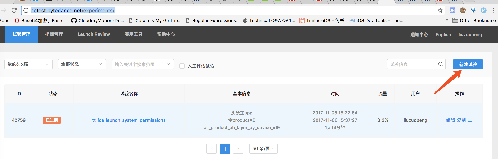
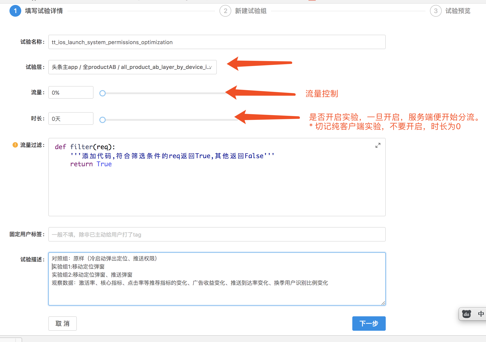
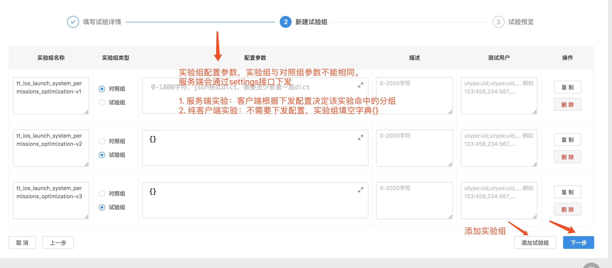
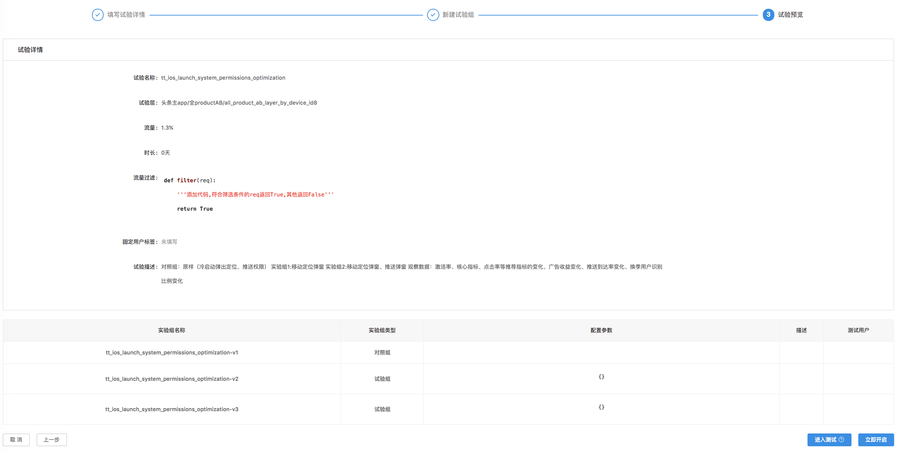
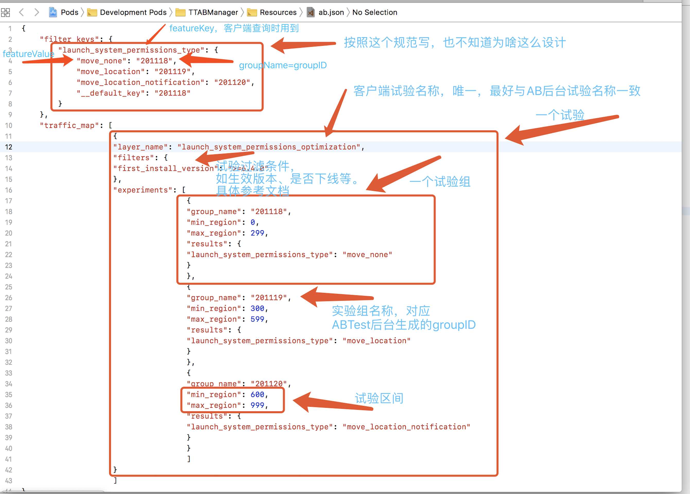
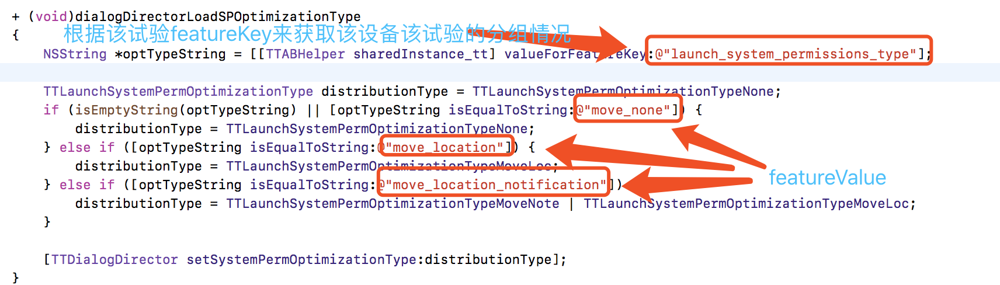
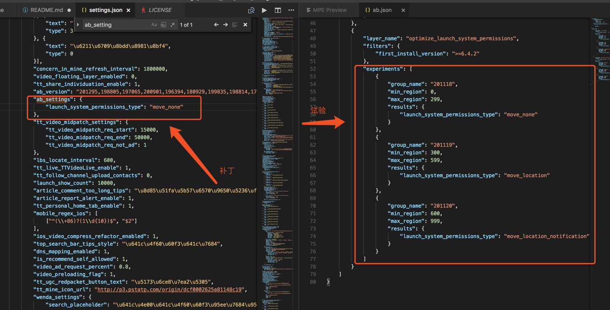

# TTABManager

[](https://travis-ci.org/highlystuff/TTABManager)
[](http://cocoapods.org/pods/TTABManager)
[](http://cocoapods.org/pods/TTABManager)
[](http://cocoapods.org/pods/TTABManager)

## Introduction

`TTABManager`是一个纯客户端实验框架。它用来在客户端进行分组试验并将分组结果与ABTest后台关联，随后可在ABTest后台查看分析报表。

##### 为什么需要客户端试验？
弄清为什么需要客户端试验，须知什么是客户端试验以及客户端试验与服务端试验的区别，

* 客户端试验在客户端进行分组，不依赖服务端下发，但会将分组结果上报给服务端进行分析。
* 服务端试验在服务端进行分组（如对在线用户通过did、odinid进行分组），因此试验的开始时机依赖网络的下发，当且仅当收到服务端下发试验配置，客户端才能开始试验，或者使用默认组进行试验。

通过对客户端试验与服务端试验进行比较可知：

* 客户端试验不依赖网络，而服务端试验依赖网络
* 客户端试验依赖发版，而服务端试验不依赖
* 客户端试验分组策略和比例不能在线调整，而服务端试验可随时调整
* 客户端试验难以下线（必须发版），而服务端试验可随时下线

即使客户端试验与服务端试验相比，服务端试验存在诸多缺点，能解决大多数场景，但客户端试验仍是必不可少的，是对服务端试验的补充，弥补了服务端试验依赖网络的不足。客户端试验应用场景是：APP启动即需分组并进行试验的情况（如对系统弹窗进行分组试验）。


##### 为什么需要客户端ABTest试验框架?

* 让业务逻辑开发RD可以不关心AB测试部分，不管是设计，还是编码与AB测试解耦。同时减少因为分组相关的代码出现错误的可能（非常容易）。提高效率，大幅度降低出现错误的可能。
* 可以简化多个试验并存的情况的设计和编码，达到正交的试验可以互不相干，相干的试验最多只能出现一个。
* 可以做到组合后的比例是固定的。


## Example

To run the example project, clone the repo, and run `pod install` from the Example directory first.

## Requirements

## Installation

TTABManager is available through [CocoaPods](http://cocoapods.org). To install
it, simply add the following line to your Podfile:

```ruby
pod "TTABManager"
```

## 使用流程

<span id="abtest_server_usage"></span>
### ABTest后台操作流程
[ABTest后台地址](http://abtest.bytedance.net/experiments/)

##### 1. 新建试验

访问[ABTest后台](http://abtest.bytedance.net/experiments/)，按下图所示新建试验。





**试验名称**：试验唯一标识，不能和其他试验名称重名，不能为中文

**试验层**：猜测是试验产品对象，根据实际情况选择

**流量**：服务端抽取线上用户的比例，不能为0%

**时长**：将开启试验的时间长度。0表示不开启，切记一旦开启，服务端将分流，因此 <纯客户端试验> 不要开启

**流量过滤**：服务端试验可使用

**固定用户标签**：......

**试验描述**：试验描述，最好填详细点，以**决不给人埋坑** 为原则


##### 2. 新建试验组

每个试验包括多个试验组，且至少包含一个试验组。试验组分两种类型：对照组和试验组；对照组是目标参考组；试验组以对照组为参照对象，进行比较和分析。

**注意服务端试验与纯客户端试验配置的不同，见下图**。




##### 3. 确认并开启试验




经过上面三步，恭喜你，已成功在ABTest平台新建了一个试验。


### 客户端添加ABTest试验流程

##### 1. 添加客户端试验

首先确认你已经在ABTest服务后台成功新建了试验，若没有请向上翻先查看 [ABTest后台开试验](#abtest_server_usage) 文档，新建一个试验。

ABTest试验新建OK后，客户端需在ab.json中新建并配置一个新的试验，具体参数描述及内容参考下图。




##### 2. 使用客户端试验

使用TTABManager之前，先介绍下面两个概念：

**featureKey:** 作为查询试验命中哪个组的key

**featureValue:** 根据featureKey查询试验命中哪个组的结果，根据结果区分命中了哪个试验组。

客户端根据试验的featureKey来获取试验命中的组，然后对不同实验组分别进行处理。（不知道为什么设计？如也可以通过`experimentName=layerName`来查询命中的组）

获取指定试验分组结果操作代码如下：

```
id featureResult = [[TTABHelper sharedInstance_tt] valueForFeatureKey:***];
```




##### 3. 上传试验结果

客户端试验结果将通过网络请求的公共字段ab_version（服务端下发，客户端回传），ab_group（客户端试验结果，服务端实际用来分析的字段），ab_feature（服务端说没用，客户端有报，不知道么意思）上报。《TTABManager已封装处理》


##### 4. 查询设备命中的试验结果

* 通过did查询uid(不是用户登录的uid，而是odinid）

 &nbsp;&nbsp;&nbsp;&nbsp;http://admin.bytedance.com/siteadmin/tools/search_odin/?device_id=196449&app_id=

* 通过odinid查询设备上报数据（可能有延时，服务端说几分钟）

 &nbsp;&nbsp;&nbsp;&nbsp;http://abtest.bytedance.net/tool/user-hit/


```

到这里，如何使用TTABManager已经可以画上一个完整的句号。

但是，你认为这是END ？？？？？？

NO ...... 

Continue ->

最后将介绍一个必不可少的主题，如何动态修改客户端命中的试验。

```


## 动态修改客户端试验

当仍沉浸在完成一个客户端实验需求的喜悦中或者......可突然突然...... balabala....报警响了，啊......，是客户端试验的某个试验组代码存在缺陷，导致命中的用户在使用会产生CRASH，怎么办？？？？？？这时的你是准备好事故通报，急急忙忙地Fix BUG等待发版呢？还是？

NO......

Don't worry......

这里它已经为你考虑到了，只要有一个试验组是好的，你就能动态下发patch，帮你将损失减少到最低；但是若是启动试验，那它也是无能为力，你还是准备发事故通报吧。。。。。。


#### 为啥需要动态修改客户端试验？

需求测试各种CASE都OK，但是上线却遇到了问题，有没有。。。。。。

需求代码逻辑漏测，有没有。。。。。。

这时，你肯定想到是否能下线，有什么策略将损失降低降低再降低？

动态patch这时就派上用场，养兵一日，用兵一时。。。。。。

动态patch存在的必要性源于APP实际运行环境的难以把控和开发人员的疏忽。


#### 如何修改客户端试验？

###### 1. 客户端试验Patch下发策略

在settings接口中有个`ab_settings`字段，用于描述补丁数据信息，结构如下：

```
"ab_setttings": {
    "featureKey1": "featureValue1",
    "featureKey2": "featureValue2",
    "featureKey3": "featureValue3",
    ......
}
```
这里的featureKey和featureValue（想要得到的试验结果）对应ab.json文件中试验相应的值。


###### 2. Patch下发案例



如上图所示，有个客户端试验--系统权限弹窗优化（launch_system_permissions_optimization），试验组`move_location`和`move_location_notification`线上存在问题，我们想动态将所有设备试验结果修改为试验`move_none`，这时你仅需在`ab_settings`接口中下发`"launch_system_permissions_type": "move_none"`补丁即可；若想仅仅向命中试验3（`move_location_notification`）的设备下发patch，这时需要找后端同学配合（数据组@魏刘曦），拿到当前设备命中试验结果，最后根据条件下发补丁。


**<h1 style="background-color:red;text-align:center">It's END ......</h1>**


## 相关文档

* ABTest系统与客户端对接机制

&nbsp;&nbsp;&nbsp;&nbsp;https://wiki.bytedance.net/pages/viewpage.action?pageId=52038336

* ClientABTest WIKI文档

&nbsp;&nbsp;&nbsp;&nbsp;https://wiki.bytedance.net/pages/viewpage.action?pageId=52052914

* 什么是odinid?

&nbsp;&nbsp;&nbsp;&nbsp;https://wiki.bytedance.net/display/TTRD/TTUID+FAQ

* 通过did查询odinid?

&nbsp;&nbsp;&nbsp;&nbsp;http://admin.bytedance.com/siteadmin/tools/search_odin/?device_id=196449&app_id=


## Author

highlystuff, fengyadong@bytedance.com


## License

TTABManager is available under the MIT license. See the LICENSE file for more info.
